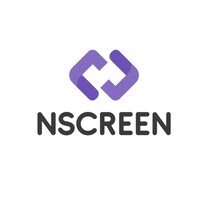

<h1 align=center> Projeto nScreen - Vaga DEV Back-End Jr.   Thiago Daniel Alvim Rodrigues</hi>  

  

---

## 💻 Sobre o projeto

 

Desenvolver uma API RESTful utilizando NestJs para gerenciar reservas. Cada reserva deve conter informações sobre a data da reserva, detalhes sobre as pessoas envolvidas na reserva (nome, data de nascimento, CPF), bem como informações adicionais

## Requisitos

- Criar Endpoints para:
  -> Criar uma nova reserva
  -> Listar todas as reservas

- Cada reserva deve conter as seguintes informações:
  -> Data da reserva.
  -> Detalhes sobre as pessoas envolvidas na reserva:
    * Nome
    * Data de Nascimento
    * CPF
  -> Informações adicionais sobre a reserva

- Utilize uma estrutura de dados adequada para armazenar as reservas (pode ser um banco de dados como SQLite com TypeORM, MongoDB, etc.)

### Sugestões de EndPoints

- POST `/reservas`
  -> Cria uma nova reserva. Corpo da requisição JSON com a data da reserva, detalhes sobre as pessoas envolvidas e informações adicionais.

- GET `/reservas`
  -> Lista todas as reservas.

### Ferramentas

- NodeJS com NestJs
- MySQL
- TypeScript
- Sequelize
- Postman (Documentação)

## :wrench: Como usar a API:

1. Clonar o repositório na máquina local utilizando o comando `git clone git@github.com:thiagodrodrigues/Desafio-Gerenciamento-De-Reservas.git`
1. Após clonar o repositório, executar o comando `npm install` ou `yarn install`.
2. Acessar o arquivo `.env example`, renomear o arquivo para `.env` e alterar a conexão do banco de dados com as seguintes instruções:
- DB_HOST="local irá rodar o servidor; exemplo 'localhost' "
- DB_PORT="porta utilizada pelo mysql; por padrão o mysql utiliza a porta 3306"
- DB_USERNAME="nome de usuario no mysql"
- DB_PASSWORD="senha de usuario no mysql"
- DB_DATABASE="Nome do banco de dados: reservationService"

4. Executar o comando `npm run create:db` que irá gerar o banco de dados e popular com exemplos.
5. Executar o comando `npm run start:dev` para iniciar sua conexão com o servidor
6. Caso tudo tenha dado certo, você está pronto para testar a API, caso não, revise o passo-a-passo

## :floppy_disk: Banco de dados:

O Banco de Dados foi criado no MySQL seguindo padrão de tabelas e colunas exposto a seguir:

 

---

## :memo: Documentação da API

A Documentação da API, rotas e exemplos foram feitos através do Postman e publicado no link:  

<h1>

 <a href="https://documenter.getpostman.com/view/24484577/2s8Z72VrRr"> Documentação API - Postman </a> 

</h1>
 

<h2> 👨‍💻 Contribuidor </h2> 

<h3>
<table align=center>
  <tr>

   <td align="center">   Thiago Rodrigues   
   </td>
   
  </tr>
</table> </h3>

## 🛠 Tecnologias

As seguintes ferramentas foram usadas na construção do projeto:
  

  
  
  
  
  
  
  
  
  
  

